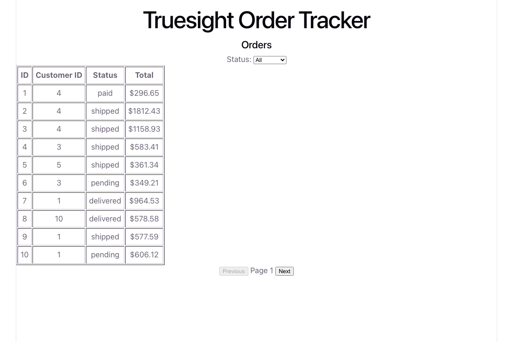

# Truesight Order Tracker

A small admin tool for browsing customer orders: filter by status, paginate through the list,
and drill into an order to see its customer and line items, with the ability to update its
fulfillment status.

**Live app:** [pleasing-analysis-production-4296.up.railway.app](https://pleasing-analysis-production-4296.up.railway.app/)



## Stack

- **Client:** React + TypeScript, built with Vite
- **Server:** Node + TypeScript, Express
- **Database:** PostgreSQL, hosted on Railway
- **Auth:** single hardcoded admin login, fixed bearer token
- **Deployment:** both client and server deployed as separate Railway services

## Project structure

```text
client/   React frontend (Vite)
server/   Express API + Postgres access + seed script
```

## Running locally

### 1. Database

Create a Postgres database (Railway, or any local Postgres) and run the schema against it:

```bash
psql "$DATABASE_URL" -f server/schema.sql
```

### 2. Server

```bash
cd server
npm install
cp .env.example .env   # fill in DATABASE_URL, ADMIN_EMAIL, ADMIN_PASSWORD, ADMIN_TOKEN
npm run seed           # optional: populate fake customers/orders/items
npm run dev            # starts the API on http://localhost:4000
```

### 3. Client

```bash
cd client
npm install
cp .env.example .env   # set VITE_API_URL to the server's URL
npm run dev            # starts the app on http://localhost:5173
```

Log in with the `ADMIN_EMAIL` / `ADMIN_PASSWORD` you set in `server/.env`.
